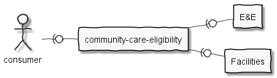

# health-apis-community-care-eligibility

This API is a [Spring Boot](https://spring.io/projects/spring-boot) microservice
that computes **objective** overall community-care eligibility by combining eligibility codes
from the Eligibility and Enrollment System (E&E) with drive-time access
standards.



Average drive times are computed by
[Facilities API](https://github.com/department-of-veterans-affairs/lighthouse-facilities),
based on the patient's physical (residential) address in E&E.

E&E is not accessible outside the VA Intranet. For local development,
[Mock-EE](https://github.com/department-of-veterans-affairs/health-apis-mock-eligibility-and-enrollment) is recommended.

For more information about the end-to-end flow of information and interactions between systems/APIs,
see the [sequence diagram](sequence-diagram.md).

For more information about the deployment architecture in different environments,
see the [architecture diagrams](architecture.md).

For details about building and running this application, see the [developer guide](developer.md).

----

The API supports a search query that accepts a patient's ICN and desired medical service type.
For auditing purposes, the API will log the `X-VA-SESSIONID` header, if it is provided.

The medical service type is one of:
* Audiology
* Cardiology
* Dermatology
* Gastroenterology
* Gynecology
* MentalHealthCare
* Nutrition
* Ophthalmology
* Optometry
* Orthopedics
* Podiatry
* PrimaryCare
* Urology
* WomensHealth

The API combines data from two sources:
1. Patient physical address, latitude and longitude, and eligibility information, from E&E.
2. VA health facilities in the state, from Facilities API.

This data is used to compute an overall determination of community-care-eligibility
based on the **objective** criteria of the MISSION Act. The six criteria are described
[here](https://www.va.gov/COMMUNITYCARE/docs/pubfiles/factsheets/VA-FS_CC-Eligibility.pdf).
The objective criteria of the MISSION Act are:
1. Service unavailable
2. Residence in a state without a full-service VA medical facility
3. 40-mile legacy/grandfathered from the Choice program
4. Access standards

For this MVP, access standards are based only on drive-times, without appointment wait times.
The last two criteria, *best medical interest* and *quality standards*, are subjective
criteria outside the scope of this API. Because the subjective criteria are not included,
this API's eligibility decisions **are not final**. A user-facing message
based on the result of this API should stress that the patient is *probably* eligible or
*probably not* eligible, and that no decision is final until they have consulted VA staff
and scheduled their appointment.

The response includes the overall eligibility decision and the individual details
(patient address, eligibility codes, nearby facilities, etc.) that were used to compute it.

Sample request:

```
https://foo.com/community-care/v0/eligibility/search?patient=011235813V213455&serviceType=primarycare
```

Sample response:

```
{
  "patientRequest" : {
    "patientIcn" : "011235813V213455",
    "serviceType" : "PrimaryCare",
    "timestamp" : "2019-05-09T13:17:58.250Z"
  },
  "eligibilityCodes" : [
    {
      "description" : "Basic",
      "code" : "B"
    }
  ],
  "grandfathered" : false,
  "noFullServiceVaMedicalFacility" : false,
  "patientAddress" : {
    "country" : "USA",
    "street" : "742 Evergeen Terrace",
    "city" : "Springfield",
    "state" : "KY",
    "zip" : "89144"
  },
  "patientCoordinates" : {
    "latitude" : 40.758541,
    "longitude" : -73.982132
  },
  "nearbyFacilities" : [
    {
      "id" : "vha_1597XY",
      "name" : "Springfield VA Clinic",
      "physicalAddress" : {
        "street" : "2584 South Street",
        "city" : "Springfield",
        "state" : "KY",
        "zip" : "10946"
      },
      "coordinates" : {
        "latitude" : 41.81,
        "longitude" : 67.65
      },
      "phoneNumber" : "177-112-8657 x",
      "website" : "https://www.va.gov"
    },
    {
      "id" : "vha_46368ZZ",
      "name" : "Shelbyville VA Clinic",
      "physicalAddress" : {
        "street" : "121393 Main Street",
        "city" : "Shelbyville",
        "state" : "KY",
        "zip" : "75025"
      },
      "mobile": false,
      "active": true,
      "coordinates" : {
        "latitude" : 196.418,
        "longitude" : 317.811
      },
      "phoneNumber" : "1-422-983-2040",
      "website" : "https://www.va.gov"
    }
  ],
  "eligible" : false
}
```
